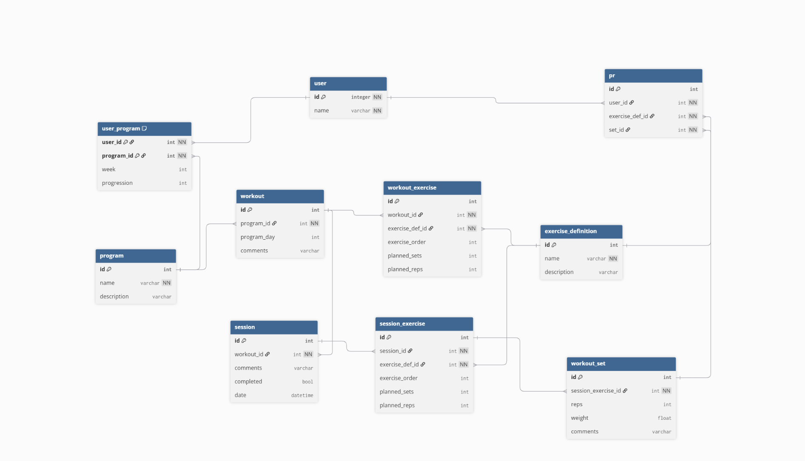

# Data Model Overview
This database is designed to support a workout tracking and program management application. The system allows users to follow structured workout programs, complete workout sessions, and track exercise performance over time. Programs are organized into workout templates, which contain ordered exercises with planned sets and reps. When a user performs a workout, a session is created to record the completed exercises and sets. The database also supports tracking progression through programs and storing personal records (PRs) tied to specific exercises and completed sets. The structure is designed to support future expansion, including user authentication and more advanced progression features.

# Entity Descriptions

## User
Stores basic user information. This table can later support authentication-related user data.
- id
- name

## User Program
Connects a user to a selected program and tracks their current progress through that program.
- user_id
- program_id
- week
- progression - Represents the current progression metric for the user within the program, such as progression level, load increases, or completion progress.

## Program
Represents a workout program or split template.
- id
- name
- description

## Workout
Represents an individual workout day within a program.
- id
- program_id
- program_day
- comments

## Workout Exercise
Defines the exercises included in a workout template, including their order and the default planned sets and reps prescribed by the program. These values represent the current template configuration and are copied into `session_exercise` when a workout session is created to preserve historical workout data.
- id
- workout_id
- exercise_def_id
- exercise_order
- planned_sets
- planned_reps

## Session
Records an attempt or completion of a workout on a specific date.
- id
- workout_id
- comments
- completed
- date

## Session Exercise
Tracks the exercises performed during a workout session, including a historical snapshot of the planned sets and reps at the time the session was created. Storing `planned_sets` and `planned_reps` separately from `workout_exercise` preserves historical accuracy if the workout template changes later.
- id
- session_id
- exercise_def_id
- exercise_order
- planned_sets
- planned_reps

## Workout Set
Records one completed set of an exercise during a session.
- id
- session_exercise_id
- reps
- weight
- comments

## Exercise Definition
Stores the exercise library used by programs, workouts, and sessions.
- id
- name
- description

## PR
Stores personal record entries by linking a user, an exercise, and the set where the PR occurred.
- id
- user_id
- exercise_def_id
- set_id

# Known Limitations and Future Considerations

The current database design is intentionally simplified to support the MVP scope of the application. Several areas may require expansion or redesign as the system grows.

One current limitation is the lack of authentication-specific user fields such as email, password hashes, roles, or account settings. The `user` table is structured so these features can be added later without major redesign.

The progression system in `user_program` is also minimal and currently stores only a generic progression value and current week. Future versions may require more advanced progression tracking, such as exercise-level progression, deload tracking, adaptive programming, or historical progression logs.

Workout templates are currently treated as static predefined data. The system does not yet support user-created programs, custom workouts, or exercise editing. Future implementations may allow users to build and share custom templates.

The current `session_exercise` structure stores planned sets and reps, but does not preserve additional metadata such as tempo, rest time, RPE, intensity targets, or exercise substitutions. These may be added later depending on application needs.

The `workout_set` table currently supports only reps, weight, and comments. This limits support for cardio movements, timed exercises, distance-based tracking, assisted movements, and other non-standard exercise formats. Additional fields or exercise-type abstractions may be required in future versions.

The PR system is also simplified. It currently links directly to a completed set but does not distinguish between different PR categories such as estimated one-rep max, rep PRs, volume PRs, or time-based records.

Finally, the current design assumes a single-user workflow without real-time collaboration, social features, or offline synchronization. Scaling the application for larger user bases or multi-device synchronization may require additional architectural considerations in the future.

